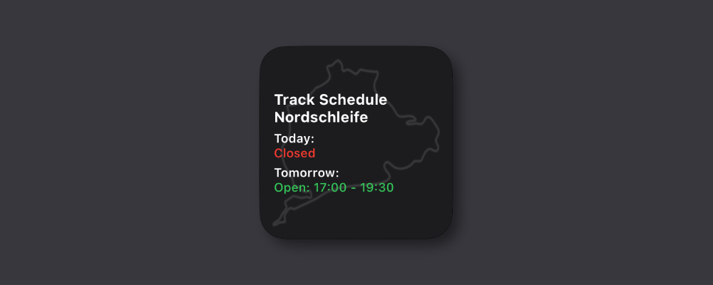

# nuerburgring-schedule-scriptable-widget

A real-time widget for iOS (Scriptable) that shows the current and upcoming open hours for **Touristenfahrten** on the **Nürburgring** – including support for **Nordschleife** and soon the **Grand Prix circuit**.

---

## ✨ Features

- Displays whether the track is open today and tomorrow
- Clear labels: “Open or “Closed” with time ranges
- Color-coded: green for open, red for closed
- Lightweight and fast: uses the official schedule from [nuerburgring.de](https://nuerburgring.de)

---

## 📲 Quick Install via ScriptDude

### Installation Instructions

1. Install [ScriptDude](https://scriptdu.de) on your iPhone or iPad.
2. Click the button above.
3. On the ScriptDude page, tap the blue **Install** button.
4. Scriptable will open and ask to add the widget script.
5. Add a Scriptable widget to your Home Screen:
   - Tap and hold → Add Widget → Scriptable
   - Choose any size
   - Tap and hold the widget → Edit Widget
   - Select `nuerburgring-schedule-scriptable-widget` as script
   - No parameter is required

---

## ⚠️ Notes

- This project is unofficial and not affiliated with Nürburgring GmbH.
- It uses public data from [https://nuerburgring.de/open-hours](https://nuerburgring.de/open-hours).

---

## 📄 License

MIT License
